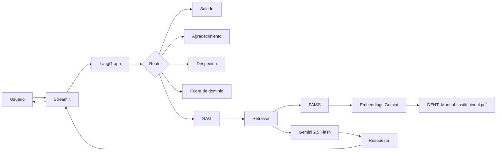
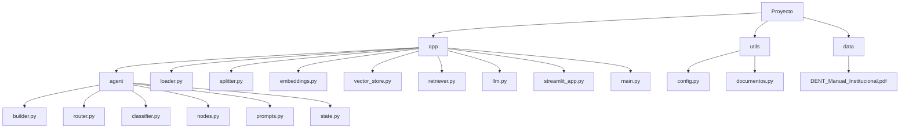
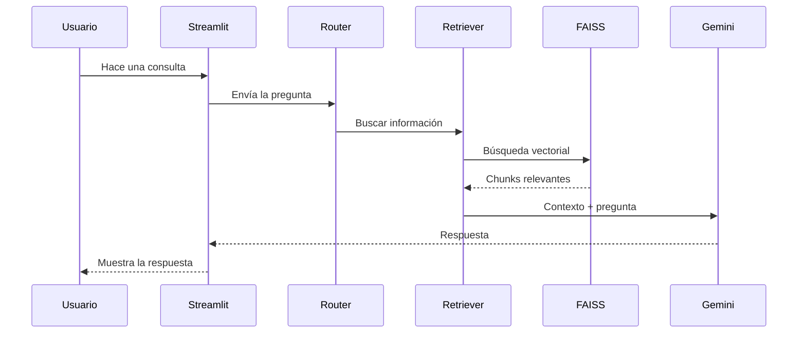

# Ingenieria_de_Agentes_y_Automatizacion_con_IA
Ingeniería de Agentes y Automatización con IA
# Arquitectura del proyecto

```mermaid
flowchart LR

U[Usuario]

S[Streamlit]

G[LangGraph]

R{Router}

N1[Saludo]
N2[Agradecimiento]
N3[Despedida]
N4[Fuera de dominio]
N5[RAG]

RET[Retriever]

F[FAISS]

E[Embeddings Gemini]

PDF[DENT_Manual_Institucional.pdf]

LLM[Gemini 2.5 Flash]

RESP[Respuesta]

U --> S
S --> G
G --> R

R --> N1
R --> N2
R --> N3
R --> N4
R --> N5

N5 --> RET
RET --> F
F --> E
E --> PDF

RET --> LLM

LLM --> RESP

RESP --> S
S --> U
```
## Organización del proyecto

```mermaid
graph TD

Proyecto

Proyecto --> app
Proyecto --> utils
Proyecto --> data

app --> agent
app --> loader.py
app --> splitter.py
app --> embeddings.py
app --> vector_store.py
app --> retriever.py
app --> llm.py
app --> streamlit_app.py
app --> main.py

agent --> builder.py
agent --> router.py
agent --> classifier.py
agent --> nodes.py
agent --> prompts.py
agent --> state.py

utils --> config.py
utils --> documentos.py

data --> DENT_Manual_Institucional.pdf
```
## Flujo RAG

```mermaid
sequenceDiagram

participant Usuario
participant Streamlit
participant Router
participant Retriever
participant FAISS
participant Gemini

Usuario->>Streamlit: Hace una consulta
Streamlit->>Router: Envía la pregunta

Router->>Retriever: Buscar información

Retriever->>FAISS: Búsqueda vectorial

FAISS-->>Retriever: Chunks relevantes

Retriever->>Gemini: Contexto + pregunta

Gemini-->>Streamlit: Respuesta

Streamlit-->>Usuario: Muestra la respuesta
```